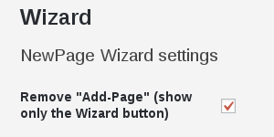

# MPAT NewPage Wizard

Step by step creating MPAT pages.

This project is also an example how to create a WordPress plugin for MPAT.
## Getting Started



### Prerequisites
This plugins depends of the [MPAT-Core plugin](https://github.com/MPAT-eu).

It uses the REST API v2 which is [built-in](https://wordpress.org/support/topic/rest-api-in-wp-4-7/) since WordPress 4.7.

### Installing

#### Using composer
```
    "repositories" : [
        ...
        {
            "type" : "vcs",
            "url" : "git@github.com:jeanphilipperuijs/mpat-newpage-wizard.git"
        },
        ...
    ],
    "require" : {
        ...
        "mpat/mpat-newpage-wizard": "dev-master",
        ...
    },
```

#### Using git
```
cd [wordpress]/plugins/

git clone https://github.com/jeanphilipperuijs/mpat-newpage-wizard.git
```

## Deployment

Add additional notes about how to deploy this on a live system

## Built With

* [Dropwizard](http://www.dropwizard.io/1.0.2/docs/) - The web framework used
* [Maven](https://maven.apache.org/) - Dependency Management
* [ROME](https://rometools.github.io/rome/) - Used to generate RSS Feeds

## Contributing

Please read [CONTRIBUTING.md](https://gist.github.com/PurpleBooth/b24679402957c63ec426) for details on our code of conduct, and the process for submitting pull requests to us.

## Versioning

We use [SemVer](http://semver.org/) for versioning. For the versions available, see the [tags on this repository](https://github.com/your/project/tags). 

## Authors

* **Billie Thompson** - *Initial work* - [PurpleBooth](https://github.com/PurpleBooth)

See also the list of [contributors](https://github.com/your/project/contributors) who participated in this project.

## License

This project is licensed under the MIT License - see the [LICENSE.md](LICENSE.md) file for details

## Acknowledgments

* Hat tip to anyone who's code was used
* Inspiration
* etc

The following error message will appear when starting the wizard if the plugin is missing:

```Missing the custom REST for Page Layouts http://[your-host]/wp-json/mpat/v1/layout. Have you installed "mpat-core-plugin" ?```
___

## Usage ##
This plugin adds by default at the top of the `page overview` a new button next to `Add New` to named `Wizard`.

In `General Settings` you can choose to replace instead of adding.
This is does the same as the following:

To replace the 'add new' button with the 'wizard':
<code>update_option('mpatNewPageWizard', 'on'));</code>

